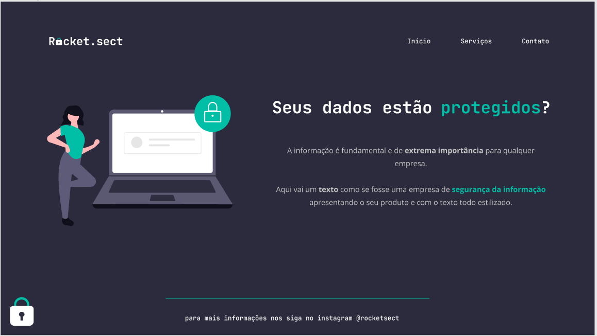

  

## 🖥️ Projeto
Seus dados estão  Protegidos.

## ✍️ Aprendizagem
* Estruturando HTML com tags semânticas
* Conceito Box Model do CSS
* Conhecendo a ferramenta de desenvolvimento DevTools 
* O conceito de Flexbox do CSS
* Melhorias na acessibilidade e refatoração
* Adicionando as fontes e melhorando os textos
* Aplicando alinhamentos e espaçamentos no main e no footer
* Configurando o botão
* Background linear-gradient e ajustes finais
 

## 🚀 Tecnologias
Esse projeto foi desenvolvido durante o EXPLORER- programação web da Rocketseat com as seguintes tecnologias:

* HTML
* CSS
* Git e Github

## 🏷️ Layout
Você pode visualizar o layout do projeto através 
[desse link](). 
É necessário ter uma conta no [Figma](https://www.figma.com)

Feito com ❤️ por <strong>Luciana</strong>. Me acompanhe nas [redes sociais!](https://luciana-maria.github.io/Cartao-de-visita-Rocketseat/)